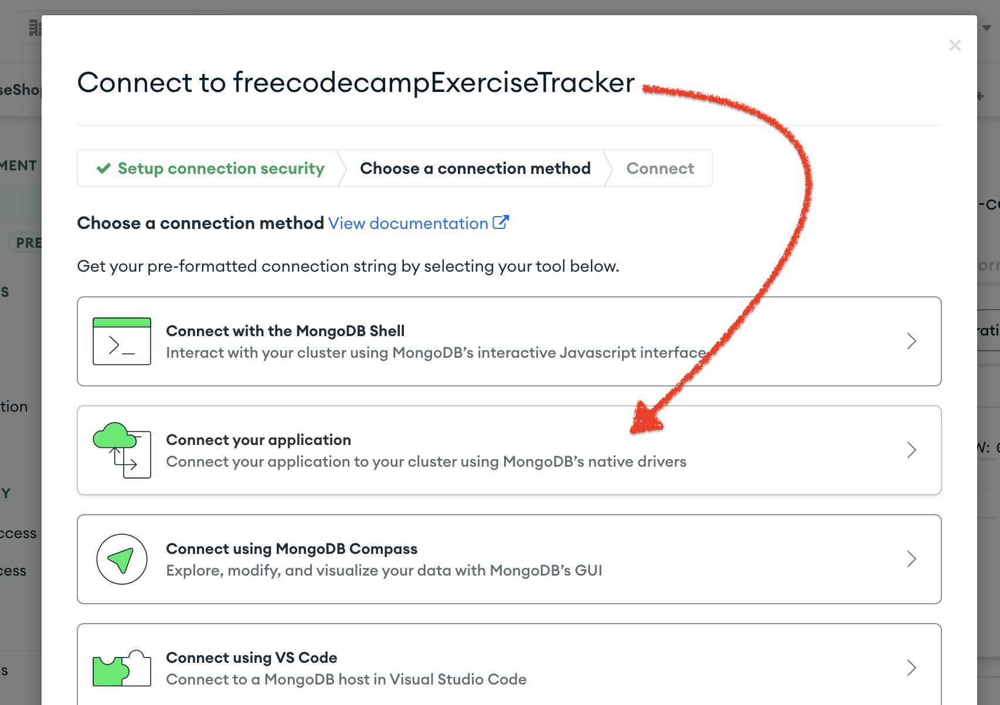

# Exercise Tracker for freecodecamp
[Link for task](https://www.freecodecamp.org/learn/back-end-development-and-apis/back-end-development-and-apis-projects/exercise-tracker)
<details>
   <summary><b> Task info </b></summary>

### Exercise Tracker
Build a full stack JavaScript app that is functionally similar to this: https://exercise-tracker.freecodecamp.rocks. Working on this project will involve you writing your code using one of the following methods:
- Clone this GitHub repo and complete your project locally.
- Use our Replit starter project to complete your project.
- Use a site builder of your choice to complete the project. Be sure to incorporate all the files from our GitHub repo.
- If you use Replit, follow these steps to set up the project:
1. Start by importing the project on Replit.
2. Next, you will see a .replit window.
3. Select Use run command and click the Done button.
- When you are done, make sure a working demo of your project is hosted somewhere public. Then submit the URL to it in the Solution Link field. Optionally, also submit a link to your project's source code in the GitHub Link field.
- Your responses should have the following structures.
```
Exercise:
{
  username: "fcc_test",
  description: "test",
  duration: 60,
  date: "Mon Jan 01 1990",
  _id: "5fb5853f734231456ccb3b05"
}
User:
{
  username: "fcc_test",
  _id: "5fb5853f734231456ccb3b05"
}
Log:
{
  username: "fcc_test",
  count: 1,
  _id: "5fb5853f734231456ccb3b05",
  log: [{
    description: "test",
    duration: 60,
    date: "Mon Jan 01 1990",
  }]
}
```
Hint: For the date property, the toDateString method of the Date API can be used to achieve the expected output.
</details>

<details>
   <summary><b> Tasks </b></summary>

### TASKS
- [x] You should provide your own project, not the example URL.
- [x] You can POST to /api/users with form data username to create a new user.
- [x] The returned response from POST /api/users with form data username will be an object with username and _id properties.
- [ ] You can make a GET request to /api/users to get a list of all users.
- [ ] The GET request to /api/users returns an array.
- [ ] Each element in the array returned from GET /api/users is an object literal containing a user's username and _id.
- [x] You can POST to /api/users/:_id/exercises with form data description, duration, and optionally date. If no date is supplied, the current date will be used.
- [x] The response returned from POST /api/users/:_id/exercises will be the user object with the exercise fields added.
- [ ] You can make a GET request to /api/users/:_id/logs to retrieve a full exercise log of any user.
- [ ] A request to a user's log GET /api/users/:_id/logs returns a user object with a count property representing the number of exercises that belong to that user.
- [ ] A GET request to /api/users/:_id/logs will return the user object with a log array of all the exercises added.
- [ ] Each item in the log array that is returned from GET /api/users/:_id/logs is an object that should have a description, duration, and date properties.
- [ ] The description property of any object in the log array that is returned from GET /api/users/:_id/logs should be a string.
- [ ] The duration property of any object in the log array that is returned from GET /api/users/:_id/logs should be a number.
- [ ] The date property of any object in the log array that is returned from GET /api/users/:_id/logs should be a string. Use the dateString format of the Date API.
- [ ] You can add from, to and limit parameters to a GET /api/users/:_id/logs request to retrieve part of the log of any user. from and to are dates in yyyy-mm-dd format. limit is an integer of how many logs to send back.
</details>

<details>
   <summary><b> Tests </b></summary>

### TESTS
- [x] You should provide your own project, not the example URL.
- [ ] You can POST to /api/users with form data username to create a new user.
- [ ] The returned response from POST /api/users with form data username will be an object with username and _id properties.
- [ ] You can make a GET request to /api/users to get a list of all users.
- [ ] The GET request to /api/users returns an array.
- [ ] Each element in the array returned from GET /api/users is an object literal containing a user's username and _id.
- [x] You can POST to /api/users/:_id/exercises with form data description, duration, and optionally date. If no date is supplied, the current date will be used.
- [x] The response returned from POST /api/users/:_id/exercises will be the user object with the exercise fields added.
- [ ] You can make a GET request to /api/users/:_id/logs to retrieve a full exercise log of any user.
- [ ] A request to a user's log GET /api/users/:_id/logs returns a user object with a count property representing the number of exercises that belong to that user.
- [ ] A GET request to /api/users/:_id/logs will return the user object with a log array of all the exercises added.
- [ ] Each item in the log array that is returned from GET /api/users/:_id/logs is an object that should have a description, duration, and date properties.
- [ ] The description property of any object in the log array that is returned from GET /api/users/:_id/logs should be a string.
- [ ] The duration property of any object in the log array that is returned from GET /api/users/:_id/logs should be a number.
- [ ] The date property of any object in the log array that is returned from GET /api/users/:_id/logs should be a string. Use the dateString format of the Date API.
- [ ] You can add from, to and limit parameters to a GET /api/users/:_id/logs request to retrieve part of the log of any user. from and to are dates in yyyy-mm-dd format. limit is an integer of how many logs to send back.
</details>

<br>

## Install Dependencies
```
git clone https://github.com/DreasWeiss/fccExerciseTracker.git
cd fccExerciseTracker
npm i
touch .env
```
in **.env** file:
```
PORT=
MONGOURI=
```  
You should input your data without spaces (ex. PORT=1234)
  - **PORT** - is the Preferred Port for Working Application
  - **MONGOURI** - MongoURI (also known as MongoDB URI) is an object-oriented programming language designed to work with the popular NoSQL database, MongoDB. It provides a high level of abstraction and allows developers to easily query or manipulate data from within their applications without having direct access to the underlying API.

<details>
   <summary><b> How to get MONGOURI </b></summary>

  [Link to mongo db atlas](https://www.mongodb.com/atlas/database)
  1.  
  2.  
  3.  

</details>

you should make some corrections in copied text from mongobd atlas:
```
we have something like this:
mongodb+srv://<username>:<password>@fccextra.p4prcl.mongodb.net/?retryWrites=true&w=majority
we need to remove all after ? and add the title you want
mongodb+srv://<username>:<password>@fccextra.p4prcl.mongodb.net/exerciseTracker
```
Then
```
nodemon index.js
```
